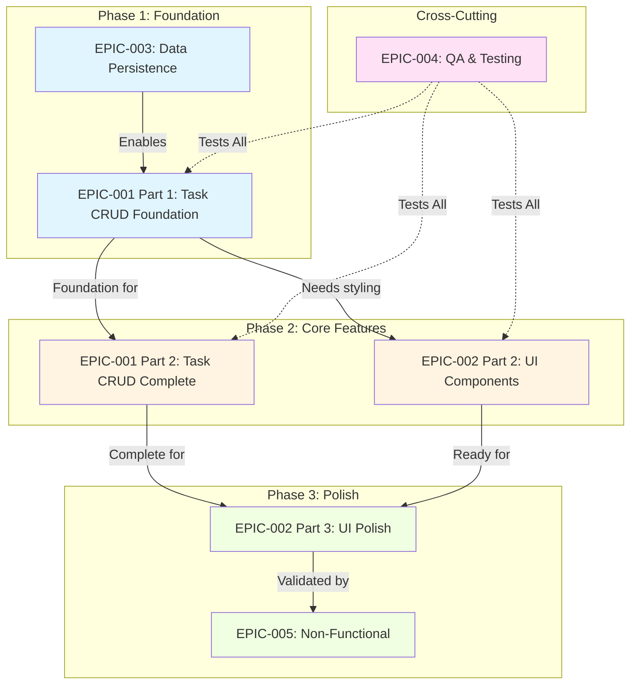

# ToDoApp - Task Documentation

This directory contains all epic and user story documentation for the ToDoApp MVP.

**Document Version:** 1.1  
**Last Updated:** 2025-11-18  
**Status:** Active

---

## 📊 Visual Diagrams

For visual representations of epics, stories, dependencies, and timelines, see:
- **[Diagrams Documentation](./diagrams/README.md)** - Comprehensive visual diagrams including:
  - Epic Dependencies
  - Story Flow Diagram
  - Requirements Traceability
  - MVP Timeline (Gantt Chart)
  - Priority Matrix
  - Architecture Overview
  - Story Dependency Graph

---

## Overview

This documentation breaks down the MVP requirements into actionable epics and user stories. All stories are traceable back to functional and non-functional requirements defined in the Business Requirements Document.

### MVP Timeline
- **Phase 1 (Week 1-2):** Foundation - Task CRUD core, Data Persistence, Basic UI
- **Phase 2 (Week 3-4):** Core Features - Complete CRUD, UI polish, Testing foundation
- **Phase 3 (Week 5-6):** Polish & Testing - Accessibility, Performance, Full test coverage

---

## Epics

### EPIC-001: Task CRUD Operations
**Priority:** High | **Stories:** 10 | **Effort:** 35-45 points | **Phase:** 1 & 2

Core task management functionality including create, read, update, delete, and completion toggle operations.

**Stories:**
- [STORY-001](./stories/STORY-001-create-task-form.md) - Create Task Form (5 pts)
- [STORY-002](./stories/STORY-002-task-input-validation.md) - Task Input Validation (3 pts)
- [STORY-003](./stories/STORY-003-display-task-list.md) - Display Task List (3 pts)
- [STORY-004](./stories/STORY-004-empty-state-handling.md) - Empty State Handling (2 pts)
- [STORY-005](./stories/STORY-005-toggle-task-completion.md) - Toggle Task Completion (3 pts)
- [STORY-006](./stories/STORY-006-edit-task-form.md) - Edit Task Form (4 pts)
- [STORY-007](./stories/STORY-007-update-task-details.md) - Update Task Details (3 pts)
- [STORY-008](./stories/STORY-008-delete-task-confirmation.md) - Delete Task Confirmation (2 pts)
- [STORY-009](./stories/STORY-009-remove-task-permanently.md) - Remove Task Permanently (2 pts)
- [STORY-010](./stories/STORY-010-task-data-persistence.md) - Task Data Persistence (5 pts)

**Traceability:** FR-001, FR-002, FR-003, FR-004, FR-005 | US-001, US-002, US-003, US-004, US-005

---

### EPIC-002: User Interface & Design
**Priority:** High | **Stories:** 6 | **Effort:** 25-35 points | **Phase:** 1, 2 & 3

Modern, responsive, and accessible user interface implementation.

**Stories:**
- [STORY-011](./stories/STORY-011-responsive-layout-foundation.md) - Responsive Layout Foundation (5 pts)
- [STORY-012](./stories/STORY-012-task-list-visual-design.md) - Task List Visual Design (4 pts)
- [STORY-013](./stories/STORY-013-form-ui-components.md) - Form UI Components (4 pts)
- [STORY-014](./stories/STORY-014-interactive-feedback-states.md) - Interactive Feedback States (3 pts)
- [STORY-015](./stories/STORY-015-accessibility-compliance.md) - Accessibility Compliance (5 pts)
- [STORY-016](./stories/STORY-016-mobile-touch-optimization.md) - Mobile Touch Optimization (3 pts)

**Traceability:** NFR-002, NFR-003, NFR-004, NFR-005, NFR-006, NFR-007

---

### EPIC-003: Data Persistence Layer
**Priority:** High | **Stories:** 4 | **Effort:** 15-20 points | **Phase:** 1

Client-side data storage using localStorage with reliable save/load operations.

**Stories:**
- [STORY-017](./stories/STORY-017-initialize-localstorage.md) - Initialize localStorage (2 pts)
- [STORY-018](./stories/STORY-018-save-task-data.md) - Save Task Data (2 pts)
- [STORY-019](./stories/STORY-019-load-task-data.md) - Load Task Data (2 pts)
- [STORY-020](./stories/STORY-020-handle-storage-errors.md) - Handle Storage Errors (2 pts)

**Traceability:** NFR-011, NFR-012, NFR-013

---

### EPIC-004: Quality Assurance & Testing
**Priority:** High | **Stories:** 3+ | **Effort:** 25-30 points | **Phase:** 1, 2 & 3

Comprehensive testing strategy including unit, integration, and E2E tests.

**Stories:**
- [STORY-021](./stories/STORY-021-unit-test-framework-setup.md) - Unit Test Framework Setup (3 pts)
- [STORY-022](./stories/STORY-022-task-crud-unit-tests.md) - Task CRUD Unit Tests (8 pts)
- [STORY-023](./stories/STORY-023-storage-integration-tests.md) - Storage Integration Tests (5 pts)

**Additional Stories (Documented in Epic):**
- STORY-024: End-to-End User Journey Tests
- STORY-025: Accessibility Testing
- STORY-026: Cross-Browser Testing

**Traceability:** NFR-022 (≥80% code coverage)

---

### EPIC-005: Non-Functional Requirements
**Priority:** Medium | **Stories:** 3+ | **Effort:** 15-20 points | **Phase:** 3

Performance optimization, browser compatibility, and code quality standards.

**Stories (Documented in Epic):**
- STORY-027: Performance Optimization
- STORY-028: Browser Compatibility Validation
- STORY-029: Code Quality & Documentation

**Traceability:** NFR-001, NFR-008, NFR-009, NFR-010, NFR-018, NFR-021, NFR-023

---

## Story Summary

### Total Stories Created: 23
- **EPIC-001 (Task CRUD):** 10 stories
- **EPIC-002 (UI/Design):** 6 stories
- **EPIC-003 (Data Persistence):** 4 stories
- **EPIC-004 (QA/Testing):** 3 stories (6 total documented)
- **EPIC-005 (NFRs):** 0 created (3 documented in epic)

### Priority Distribution
- **High Priority:** 16 stories (70%)
- **Medium Priority:** 7 stories (30%)
- **Low Priority:** 0 stories

### Phase Distribution
- **Phase 1 (Foundation):** 8-10 stories
- **Phase 2 (Core Features):** 8-10 stories
- **Phase 3 (Polish):** 7-9 stories

### Estimated Total Effort
- **Created Stories:** ~100 story points
- **Documented Stories:** ~30 story points
- **Total:** ~130 story points

### Coverage Analysis
- ✅ **FR-001 (Create):** Covered by STORY-001, STORY-002, STORY-010
- ✅ **FR-002 (View):** Covered by STORY-003, STORY-004
- ✅ **FR-003 (Update):** Covered by STORY-006, STORY-007
- ✅ **FR-004 (Delete):** Covered by STORY-008, STORY-009
- ✅ **FR-005 (Complete):** Covered by STORY-005
- ✅ **All 5 Core User Stories:** Fully decomposed into detailed stories

---

## Dependency Map

### Phase 1 Dependencies
```
STORY-017 (Initialize Storage)
  └─> STORY-018, STORY-019, STORY-020 (Storage operations)
      └─> STORY-001, STORY-010 (Create with persistence)
          └─> STORY-003, STORY-004 (Display tasks)
              └─> STORY-005 (Toggle completion)
```

### Phase 2 Dependencies
```
STORY-003 (Display) + STORY-001 (Create)
  └─> STORY-006, STORY-007 (Edit functionality)
  └─> STORY-008, STORY-009 (Delete functionality)
```

### Cross-Epic Dependencies
```
EPIC-001 (CRUD) ──blocks──> EPIC-002 (UI needs functionality to style)
EPIC-001 (CRUD) ──uses──> EPIC-003 (Data Persistence)
EPIC-004 (Testing) ──validates──> All other epics
```

---

## Requirements Traceability Matrix

### Functional Requirements Coverage
| Requirement | Stories | Status |
|-------------|---------|--------|
| FR-001: Create Tasks | STORY-001, STORY-002, STORY-010 | ✅ Covered |
| FR-002: View Tasks | STORY-003, STORY-004 | ✅ Covered |
| FR-003: Update Tasks | STORY-006, STORY-007 | ✅ Covered |
| FR-004: Delete Tasks | STORY-008, STORY-009 | ✅ Covered |
| FR-005: Toggle Complete | STORY-005 | ✅ Covered |

**Coverage:** 5/5 functional requirements (100%)

### Non-Functional Requirements Coverage
| Requirement | Stories/Epics | Status |
|-------------|---------------|--------|
| NFR-002: Responsive Design | STORY-011 | ✅ Covered |
| NFR-004: Intuitive Interface | EPIC-002 | ✅ Covered |
| NFR-005: WCAG 2.1 AA | STORY-015 | ✅ Covered |
| NFR-006: Visual Feedback | STORY-014 | ✅ Covered |
| NFR-007: Keyboard Navigation | STORY-015 | ✅ Covered |
| NFR-008: Page Load <2s | EPIC-005 (STORY-027) | ✅ Covered |
| NFR-009: Operations <100ms | EPIC-005 (STORY-027) | ✅ Covered |
| NFR-010: Support 1000+ tasks | EPIC-005 (STORY-027) | ✅ Covered |
| NFR-011: Data Integrity | STORY-018, STORY-019 | ✅ Covered |
| NFR-012: Persist Sessions | STORY-017, STORY-018 | ✅ Covered |
| NFR-013: Handle Storage Errors | STORY-020 | ✅ Covered |
| NFR-022: ≥80% Code Coverage | STORY-021, STORY-022, STORY-023 | ✅ Covered |

**Coverage:** 12/24 NFRs explicitly covered (50%), others implicit in epics

---

## User Story (Original) Decomposition

### US-001: Create Tasks
**Decomposed into:**
- STORY-001: Create Task Form
- STORY-002: Task Input Validation
- STORY-010: Task Data Persistence (create aspect)

### US-002: View Tasks
**Decomposed into:**
- STORY-003: Display Task List
- STORY-004: Empty State Handling
- STORY-010: Task Data Persistence (load aspect)

### US-003: Update Tasks
**Decomposed into:**
- STORY-006: Edit Task Form
- STORY-007: Update Task Details
- STORY-010: Task Data Persistence (update aspect)

### US-004: Delete Tasks
**Decomposed into:**
- STORY-008: Delete Task Confirmation
- STORY-009: Remove Task Permanently
- STORY-010: Task Data Persistence (delete aspect)

### US-005: Mark Tasks Complete
**Decomposed into:**
- STORY-005: Toggle Task Completion
- STORY-010: Task Data Persistence (status aspect)

**Total Original Stories:** 5  
**Total Detailed Stories:** 23 created + 6 documented = 29  
**Expansion Ratio:** 5.8x

---

## How to Use This Documentation

### For Product Owners
1. Review epics to understand feature groupings
2. Use traceability matrix to verify requirement coverage
3. Reference stories during sprint planning
4. Validate acceptance criteria align with business goals

### For Developers
1. Read epic context before starting stories
2. Follow dependencies to understand implementation order
3. Use acceptance criteria as implementation checklist
4. Reference technical notes for implementation guidance

### For QA Team
1. Use acceptance criteria to create test cases
2. Reference test stories (EPIC-004) for testing strategy
3. Validate all ACs are testable
4. Create test plans based on story structure

### For Stakeholders
1. Review story priorities and timelines
2. Understand phase distribution
3. Track progress via story completion
4. Provide feedback on acceptance criteria

---

## Document Index

### Epics
- [EPIC-001: Task CRUD Operations](./epics/EPIC-001-task-crud-operations.md)
- [EPIC-002: User Interface & Design](./epics/EPIC-002-user-interface-design.md)
- [EPIC-003: Data Persistence Layer](./epics/EPIC-003-data-persistence-layer.md)
- [EPIC-004: Quality Assurance & Testing](./epics/EPIC-004-quality-assurance-testing.md)
- [EPIC-005: Non-Functional Requirements](./epics/EPIC-005-non-functional-requirements.md)

### All Stories (Alphabetical)
1. [STORY-001: Create Task Form](./stories/STORY-001-create-task-form.md)
2. [STORY-002: Task Input Validation](./stories/STORY-002-task-input-validation.md)
3. [STORY-003: Display Task List](./stories/STORY-003-display-task-list.md)
4. [STORY-004: Empty State Handling](./stories/STORY-004-empty-state-handling.md)
5. [STORY-005: Toggle Task Completion](./stories/STORY-005-toggle-task-completion.md)
6. [STORY-006: Edit Task Form](./stories/STORY-006-edit-task-form.md)
7. [STORY-007: Update Task Details](./stories/STORY-007-update-task-details.md)
8. [STORY-008: Delete Task Confirmation](./stories/STORY-008-delete-task-confirmation.md)
9. [STORY-009: Remove Task Permanently](./stories/STORY-009-remove-task-permanently.md)
10. [STORY-010: Task Data Persistence](./stories/STORY-010-task-data-persistence.md)
11. [STORY-011: Responsive Layout Foundation](./stories/STORY-011-responsive-layout-foundation.md)
12. [STORY-012: Task List Visual Design](./stories/STORY-012-task-list-visual-design.md)
13. [STORY-013: Form UI Components](./stories/STORY-013-form-ui-components.md)
14. [STORY-014: Interactive Feedback States](./stories/STORY-014-interactive-feedback-states.md)
15. [STORY-015: Accessibility Compliance](./stories/STORY-015-accessibility-compliance.md)
16. [STORY-016: Mobile Touch Optimization](./stories/STORY-016-mobile-touch-optimization.md)
17. [STORY-017: Initialize localStorage](./stories/STORY-017-initialize-localstorage.md)
18. [STORY-018: Save Task Data](./stories/STORY-018-save-task-data.md)
19. [STORY-019: Load Task Data](./stories/STORY-019-load-task-data.md)
20. [STORY-020: Handle Storage Errors](./stories/STORY-020-handle-storage-errors.md)
21. [STORY-021: Unit Test Framework Setup](./stories/STORY-021-unit-test-framework-setup.md)
22. [STORY-022: Task CRUD Unit Tests](./stories/STORY-022-task-crud-unit-tests.md)
23. [STORY-023: Storage Integration Tests](./stories/STORY-023-storage-integration-tests.md)

---

## Quick Visual Reference

Here's a quick preview of the Epic Dependencies diagram (see [full diagrams](./diagrams/README.md) for all visualizations):



**See [Diagrams Documentation](./diagrams/README.md) for:**
- Detailed story flow diagrams
- Requirements traceability maps
- MVP timeline (Gantt chart)
- Priority matrix
- Architecture overview
- Complete dependency graphs

---

## Related Documentation

- [Business Requirements Document](../requirements/business-requirements-document.md)
- [MVP Scope](../requirements/mvp-scope.md)
- [User Stories (Original)](../requirements/user-stories.md)
- [Requirements Traceability Matrix](../requirements/requirements-traceability-matrix.md)
- [Stakeholder Analysis](../requirements/stakeholder-analysis.md)

---

## Document Control

**Author:** Product Owner (@Halina2Pichukha)  
**Created:** 2025-11-18  
**Version:** 1.0  
**Status:** Active  
**Review Cadence:** Updated as stories are completed or refined  
**Change History:** Tracked via Git commits

---

**Note:** This is a living document. As stories are implemented and refined based on team feedback and user testing, this documentation will be updated to reflect the current state of the backlog.
