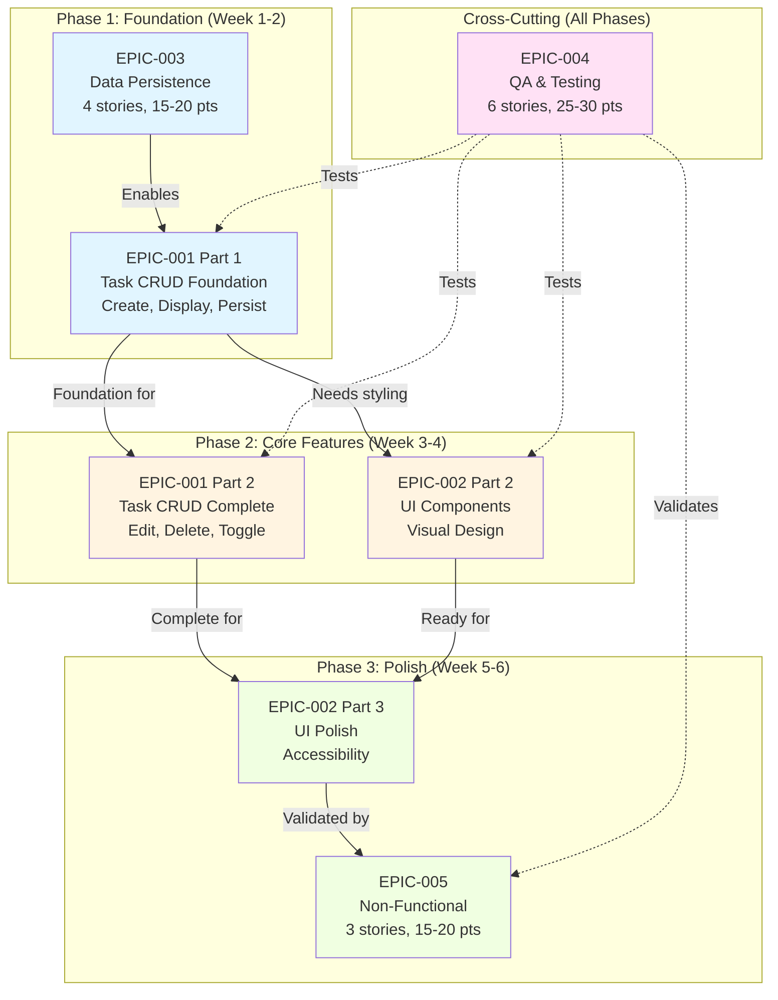
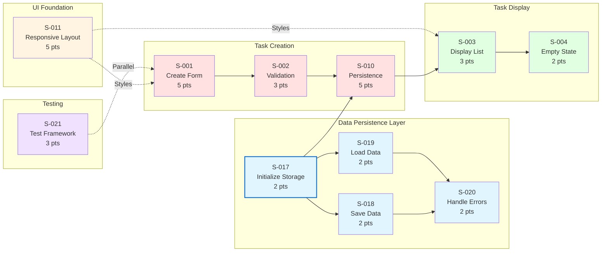
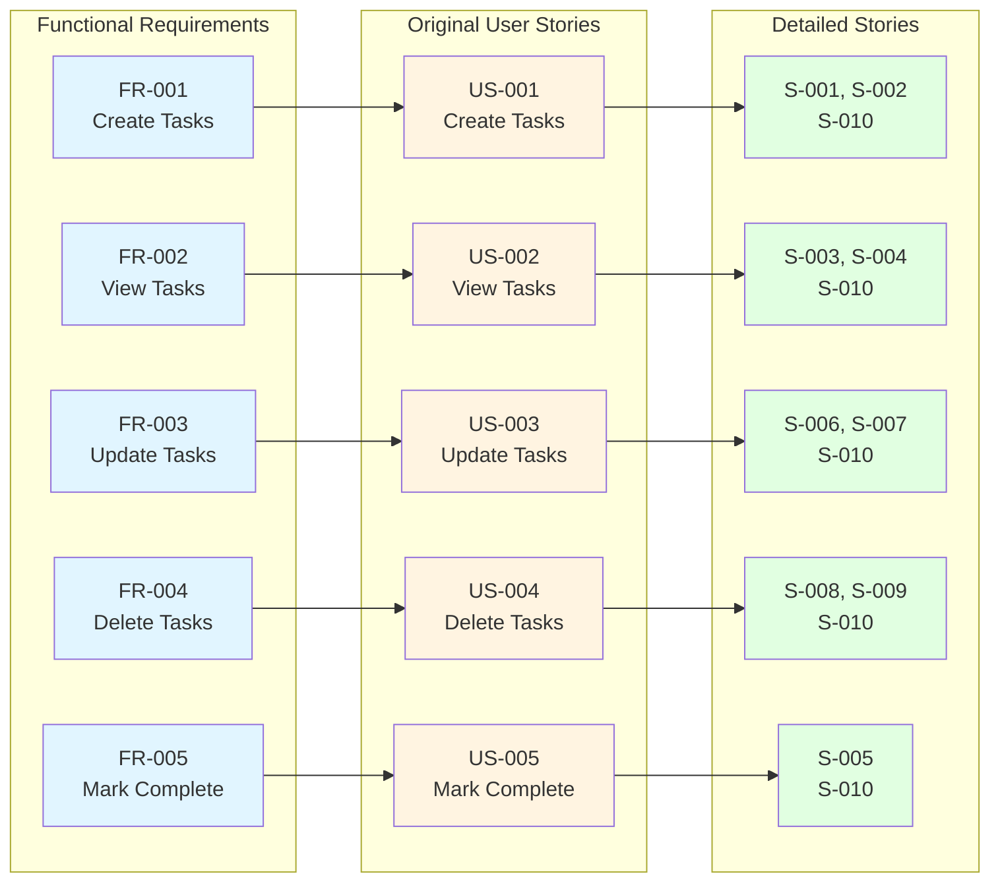
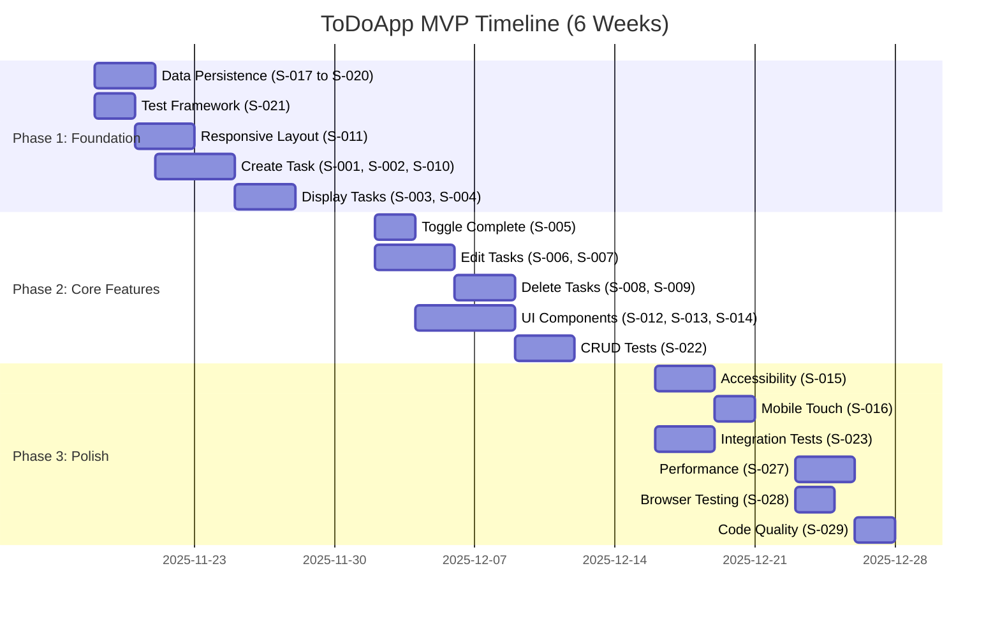
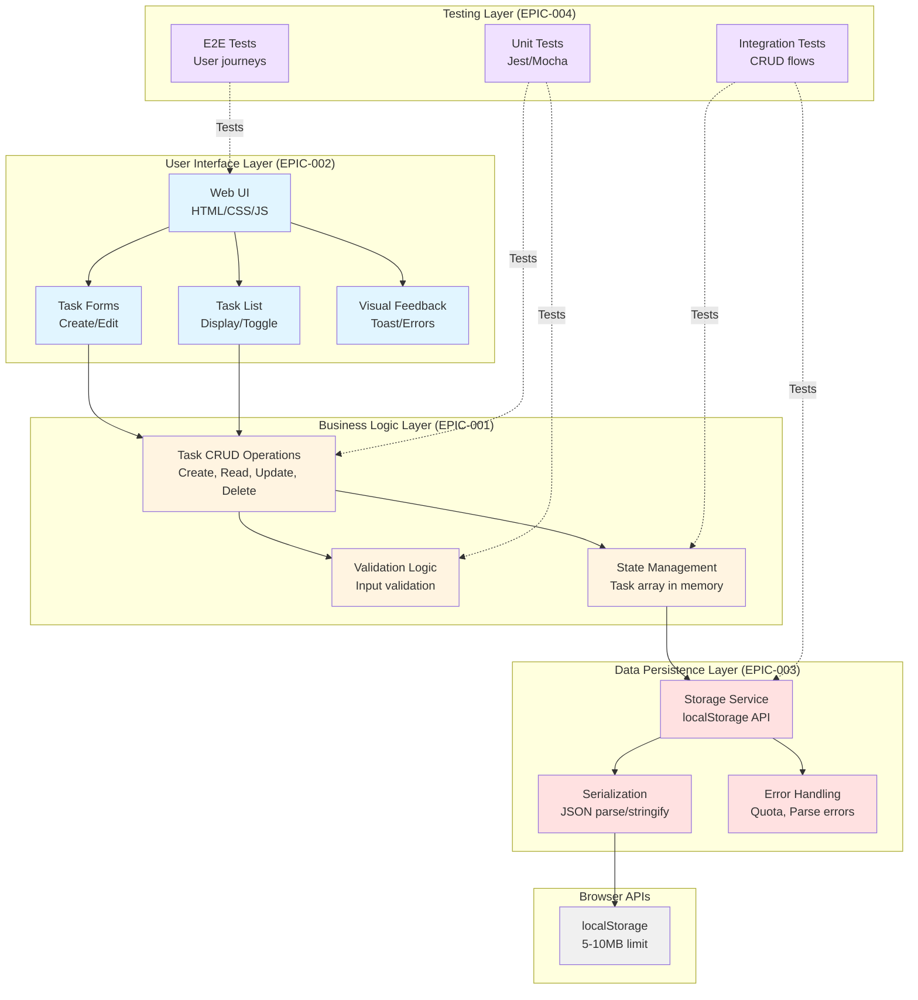
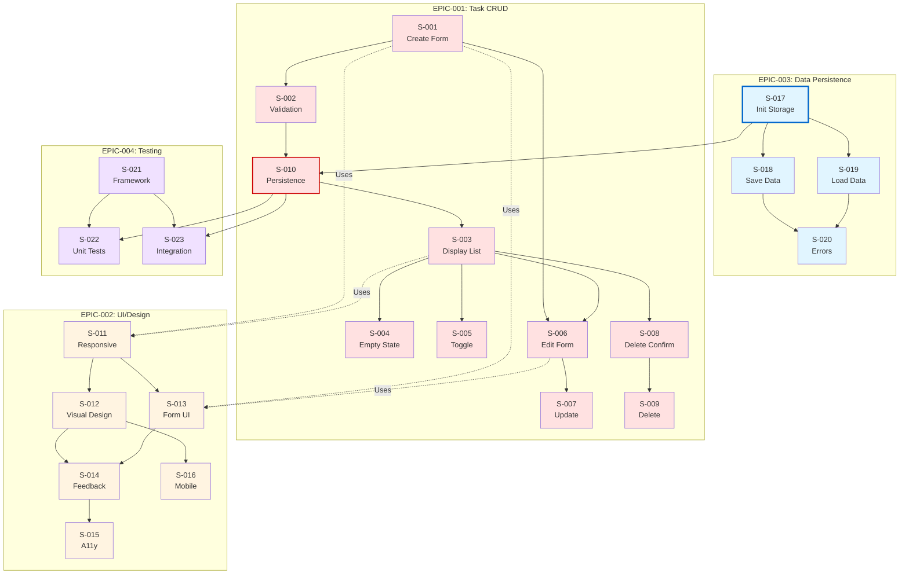

# ToDoApp - Diagrams

This directory contains visual diagrams that illustrate the relationships, dependencies, and structure of epics and user stories for the ToDoApp MVP.

**Document Version:** 1.0  
**Last Updated:** 2025-11-18  
**Status:** Active

---

## Diagram Index

1. [Epic Dependencies](#epic-dependencies) - Shows relationships between epics
2. [Story Flow Diagram](#story-flow-diagram) - Shows story dependencies and implementation order
3. [Requirements Traceability](#requirements-traceability) - Maps requirements to stories
4. [MVP Timeline](#mvp-timeline) - Shows phase distribution and timeline
5. [Priority Matrix](#priority-matrix) - Shows story prioritization
6. [Architecture Overview](#architecture-overview) - High-level system architecture
7. [Story Dependency Graph](#story-dependency-graph-detailed) - Complete dependency mapping

---

## Epic Dependencies

This diagram shows how the 5 epics relate to each other and their dependencies.



### Epic Relationships

- **EPIC-003 (Data Persistence)** is the foundation - must be implemented first
- **EPIC-001 (Task CRUD)** depends on EPIC-003 for data storage
- **EPIC-002 (UI/Design)** builds on EPIC-001 functionality
- **EPIC-004 (Testing)** is cross-cutting and validates all other epics
- **EPIC-005 (NFRs)** validates the complete system in Phase 3

---

## Story Flow Diagram

This diagram shows the recommended implementation order for stories within Phase 1 (Foundation).



### Implementation Order (Phase 1)

**Week 1:**
1. S-017: Initialize localStorage (foundation)
2. S-018, S-019: Save/Load operations
3. S-021: Test framework setup (parallel)
4. S-011: Responsive layout foundation
5. S-001: Create task form

**Week 2:**
6. S-002: Input validation
7. S-010: Task data persistence integration
8. S-003: Display task list
9. S-004: Empty state handling
10. S-020: Storage error handling

---

## Requirements Traceability

This diagram shows how Functional Requirements map to User Stories and detailed Stories.



### Coverage Summary

- **5 Functional Requirements** → **5 Original User Stories** → **23+ Detailed Stories**
- **Expansion Ratio:** 5.8x (from 5 to 29 stories)
- **100% FR Coverage:** All functional requirements mapped to stories

---

## MVP Timeline

This Gantt-style diagram shows the distribution of stories across the 3 MVP phases.



### Phase Breakdown

| Phase | Duration | Stories | Story Points | Focus |
|-------|----------|---------|--------------|-------|
| Phase 1 | Week 1-2 | 10 stories | ~35 points | Foundation: CRUD core, persistence, basic UI |
| Phase 2 | Week 3-4 | 9 stories | ~35 points | Core Features: Complete CRUD, UI polish, testing |
| Phase 3 | Week 5-6 | 10 stories | ~30 points | Polish: Accessibility, performance, validation |
| **Total** | **6 weeks** | **29 stories** | **~100 points** | **Complete MVP** |

---

## Priority Matrix

This diagram shows story prioritization based on Business Value vs Technical Complexity.

```mermaid
quadrantChart
    title Story Priority Matrix
    x-axis Low Technical Complexity --> High Technical Complexity
    y-axis Low Business Value --> High Business Value
    quadrant-1 High Value, High Complexity (Plan Carefully)
    quadrant-2 High Value, Low Complexity (Do First!)
    quadrant-3 Low Value, Low Complexity (Quick Wins)
    quadrant-4 Low Value, High Complexity (Reconsider)
    
    S-017 Initialize Storage: [0.2, 0.9]
    S-001 Create Form: [0.5, 0.95]
    S-003 Display List: [0.3, 0.9]
    S-005 Toggle Complete: [0.3, 0.85]
    S-010 Persistence: [0.6, 0.95]
    S-011 Responsive Layout: [0.5, 0.8]
    S-002 Validation: [0.4, 0.75]
    S-006 Edit Form: [0.5, 0.7]
    S-007 Update Details: [0.4, 0.7]
    S-008 Delete Confirm: [0.2, 0.65]
    S-009 Delete Permanent: [0.3, 0.65]
    S-004 Empty State: [0.2, 0.5]
    S-015 Accessibility: [0.7, 0.85]
    S-022 Unit Tests: [0.8, 0.8]
    S-012 Visual Design: [0.5, 0.7]
    S-016 Mobile Touch: [0.4, 0.6]
    S-020 Error Handling: [0.3, 0.7]
```

### Priority Quadrants

**Quadrant 2 (High Value, Low Complexity) - Do First:**
- S-017: Initialize Storage
- S-003: Display List
- S-005: Toggle Complete
- S-004: Empty State
- S-008: Delete Confirm

**Quadrant 1 (High Value, High Complexity) - Plan Carefully:**
- S-001: Create Form
- S-010: Persistence Integration
- S-015: Accessibility Compliance
- S-022: Unit Tests

**Quadrant 3 (Low Value, Low Complexity) - Quick Wins:**
- S-002: Validation
- S-016: Mobile Touch
- S-020: Error Handling

**Quadrant 4 (Low Value, High Complexity) - None:**
- All stories provide sufficient value to justify complexity

---

## Architecture Overview

This diagram shows the high-level architecture of the ToDoApp MVP.



### Layer Responsibilities

**User Interface Layer (EPIC-002):**
- Handles all user interactions
- Renders task lists and forms
- Displays visual feedback
- Implements responsive design and accessibility

**Business Logic Layer (EPIC-001):**
- Manages task CRUD operations
- Validates user input
- Maintains application state
- Enforces business rules

**Data Persistence Layer (EPIC-003):**
- Provides storage abstraction
- Handles serialization/deserialization
- Manages storage errors
- Ensures data integrity

**Testing Layer (EPIC-004):**
- Validates all layers
- Ensures code coverage ≥80%
- Catches regressions
- Validates user journeys

---

## Story Dependency Graph (Detailed)

This comprehensive diagram shows all story dependencies across all epics.



### Critical Path

The critical path through the dependencies is:
**S-017 → S-018/S-019 → S-010 → S-003 → S-005/S-006/S-008**

This path represents the minimum set of stories needed to have a working task management application:
1. Initialize storage (S-017)
2. Implement save/load (S-018, S-019)
3. Integrate persistence (S-010)
4. Display tasks (S-003)
5. Enable core operations (S-005, S-006, S-008)

---

## How to Use These Diagrams

### For Product Owners
- Use **Epic Dependencies** to understand epic relationships
- Use **MVP Timeline** for sprint planning and stakeholder communication
- Use **Priority Matrix** to make scope decisions

### For Developers
- Use **Story Flow** to understand implementation order
- Use **Architecture Overview** to understand system structure
- Use **Story Dependency Graph** to identify blockers

### For QA Team
- Use **Story Flow** to plan test development
- Use **Architecture Overview** to understand test layers
- Use **Requirements Traceability** to ensure test coverage

### For Stakeholders
- Use **MVP Timeline** to track progress
- Use **Priority Matrix** to understand prioritization
- Use **Requirements Traceability** to validate scope

---

## Related Documentation

- [Main Task Documentation](../README.md)
- [Business Requirements Document](../../requirements/business-requirements-document.md)
- [MVP Scope](../../requirements/mvp-scope.md)

---

**Last Updated:** 2025-11-18  
**Maintained By:** Product Owner Team
